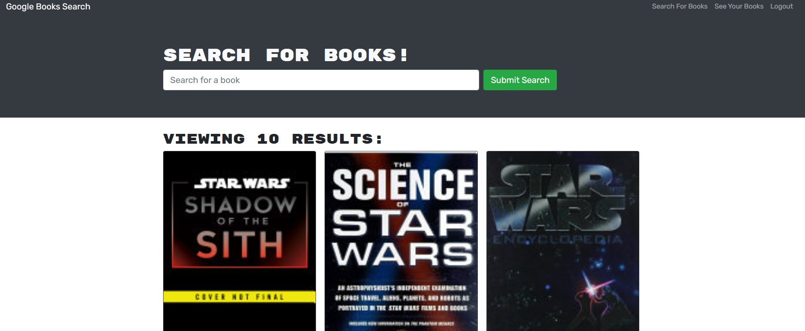
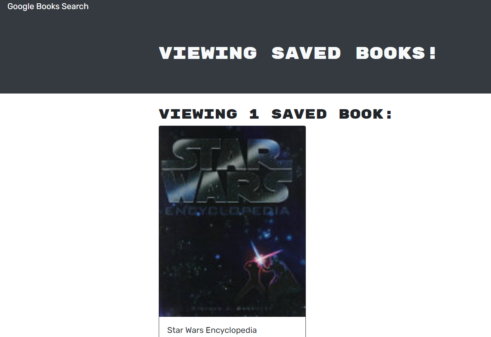

# GOOGLE BOOK SEARCH ENGINE

[](https://github.com/msp4msps)
[](https://github.com/msp4msps/book-search-engine)
[](https://github.com/msp4msps/book-search-engine)
[](https://choosealicense.com/licenses/mit/)

## Table of Content

- [ Project Links ](#Project-Links)
- [ Screenshots](#Screenshots)
- [ Project Description ](#Project-Description)
- [ User Story ](#User-Story)
- [ Technologies ](#Technologies)
- [ Installation ](#Installation)
- [ Usage ](#Usage)
- [ Credits and Reference ](#Credits-and-Reference)
- [ Tests ](#Tests)
- [ Contributing ](#Contributing)
- [ Questions ](#Questions)
- [ License ](#License)

#

## Project Links

https://github.com/msp4msps/book-search-engine<br>
https://google-book-search4.herokuapp.com/

## Screenshots-Demo

<kbd></kbd><kbd></kbd>

## Project Description

The following project leverages GraphQL, Apollo, and the Google Books API to allow users to search and save books

## User Story

AS AN avid reader, I WANT to search for new books to read SO THAT I can keep a list of books to purchase

## Technologies

```
Node, GraphQL, Apollo, React, Mongo, Heroku
```

## Installation

Click on the live link to go to the production site

## Usage

Sign up with a new username, email, password. Search for books and save them to your collection.

## Tests

Fork the repo, clone locally, run npm run install, npm run build, npm run develop

## Contributing

Open a pull request

## Questions

Contact the author with any questions!<br>
Github link: [msp4msps](https://github.com/msp4msps)<br>
Email: msp4msps@tminus365.com

## License

This project is [MIT](https://choosealicense.com/licenses/mit/) licensed.<br />
Copyright © 2022 [NICK ROSS](https://github.com/msp4msps)
